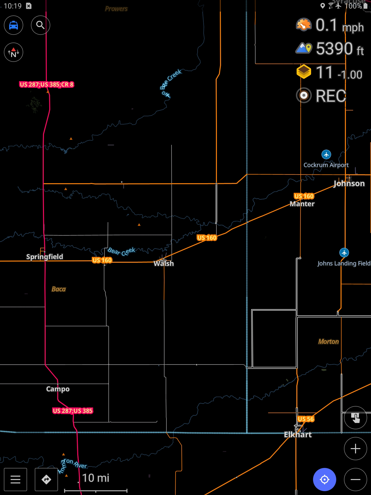

## stormchasing.render.xml
This is an OsmAnd rendering style optimized for storm chasing. It's been tested on Android and depends on the LightRS rendering style (included with OsmAnd by default).

**Key features**
- Paved roads are rendered in bright colors for daytime readability.
- Roads with low surface integrity (gravel, dirt) are rendered in gray across zoom levels and road types.
- Primary, secondary, and tertiary road types are all rendered starting at the same zoom level to quickly find paved navigation routes.
- Local road types are rendered at the next zoom level for close range interception.
- Trails that are likely impassable are rendered as dashed lines
- Roads without surface integrity information are easily identified by a hollow rendering style. Please contribute to the underlying OSM data -- especially surface integrity! See instructions below on how to do this.

## Installing
- Copy stormchasing.render.xml into the `Android/data/net.osmand/files/rendering` directory (or `net.osmand.plus` for OsmAnd plus and `net.osmand.dev` for OsmAnd nightly/beta) on the Android device (these files should be visible through any file manager, or when browsing files via USB).
- Enable the style by going to Menu->Configure map->Map rendering->Map style and selecting the *Stormchasing* style

## How to update road surface information in the OSM data
- Go to https://www.openstreetmap.org/ and log in or sign up
- Zoom far enough into the map at the desired location to activate the *Edit* button
- Select the features to edit (hold down shift key to multi-select)
- Set [*surface*](https://wiki.openstreetmap.org/wiki/Key:surface) drop-down as appropriate. For example: asphalt, concrete, dirt, or gravel

NOTE: For a dirt surface, OsmAnd's [*calculateIntegrity* method](https://github.com/osmandapp/OsmAnd-tools/blob/master/java-tools/OsmAndMapCreatorUtilities/src/main/java/net/osmand/osm/MapRenderingTypesEncoder.java) considers dirt to be higher integrity than gravel. This is bad for chase navigation because dirt will quickly turn to impassable mud when wet. And the *mud* surface type is reserved for [roads that are muddy most of the time](https://wiki.openstreetmap.org/wiki/Tag:surface%3Dmud). So for a dirt road that turns into a rutted, muddy road when wet, be sure to add the [*smoothness* tag](https://wiki.openstreetmap.org/wiki/Key:smoothness) and set the value to *bad* or worse. This will allow OsmAnd to visually differentiate between good gravel and poor dirt.

## Existing rendering styles
**LightRS**
* Distinguishes well between unclassified highway types (which is often unpaved but not always) and classified (which is often paved but not always)  
* Shows more highway labels  
* Doesn't distinguish by road surface type  
* Night mode changes surface-identifying colors when zoomed in - paved roads are too dark

**Offroad**
* Distinguishes well between surface types only when zoomed in to 12+  
* Displays trails too boldly especially when zoomed in  
* Doesn't distinguish well enough between unclassified and other highway types which can help indicate maintenance level

**Topo**
* Distinguishes well between surface types only when zoomed in to 12+  
* Displays trails too boldly